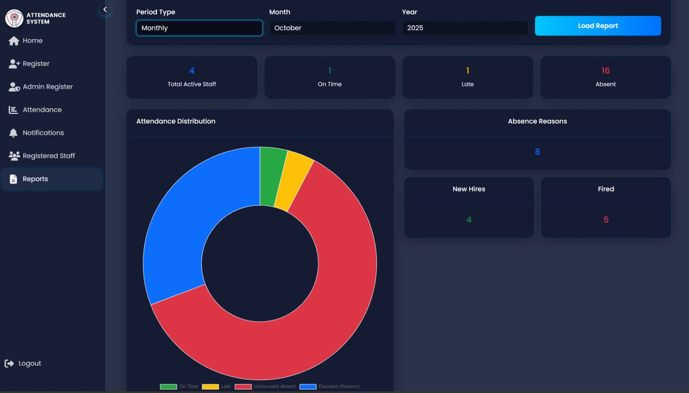

# 🧠 Face Recognition Attendance System (Flask + InsightFace)
<div align="center">
  
</div>
<br/>
<br/>
A lightweight **Face Recognition Attendance System** built with **Flask** and **InsightFace**, using **JSON files** for data storage — no SQL or external database required.

This app recognizes faces in real-time or from uploaded images, marking attendance automatically and storing records in local JSON files.

---

## 🚀 Features

* 🔍 **Real-time Face Recognition** using InsightFace
* 🧠 **Face Registration** — add new users via web interface
* 🧾 **Attendance Logs stored in JSON files**
* 📸 **Live webcam or image upload** support
* 🌐 **Flask backend + HTML frontend**
* ⚙️ **Auto-setup script runs during installation** (creates model/data folders)
* 🧰 **Minimal dependencies — no SQL required**

---


## 🧩 Dependencies

Key libraries used:

* **Flask** – Web backend
* **InsightFace** – Face detection & embeddings
* **opencv-python** – Camera and image capture
* **numpy** – Array and math operations
* **bcrypt** - To encrypt and decrypt files

---

## ⚙️ Installation

1. **Clone this repository**

   ```bash
   git clone https://github.com/yourusername/face-recognition-attendance.git
   cd face-recognition-attendance
   ```

2. **Create and activate a virtual environment**

   ```bash
   python -m venv venv
   source venv/bin/activate       # Linux/Mac
   venv\Scripts\activate          # Windows
   ```

3. **Install dependencies**

   ```bash
   pip install -r requirements.txt
   ```

   ✅ During this step:

   * `utils/setup.py` automatically:

     * Creates `data/` and `models/` folders if missing
     * Initializes empty `users.json` and `attendance.json` files
     * Downloads the InsightFace model if not present

---


---

## ▶️ Run the App

```bash
python app.py
```

Then open your browser at:

```
http://127.0.0.1:5000
```


## 🛠️ Future Improvements

* 🔒 JWT-based authentication for admin access
* 📤 Export attendance JSON to CSV/Excel
* 📱 Responsible interface
* ☁️ Cloud storage integration (optional)

---

